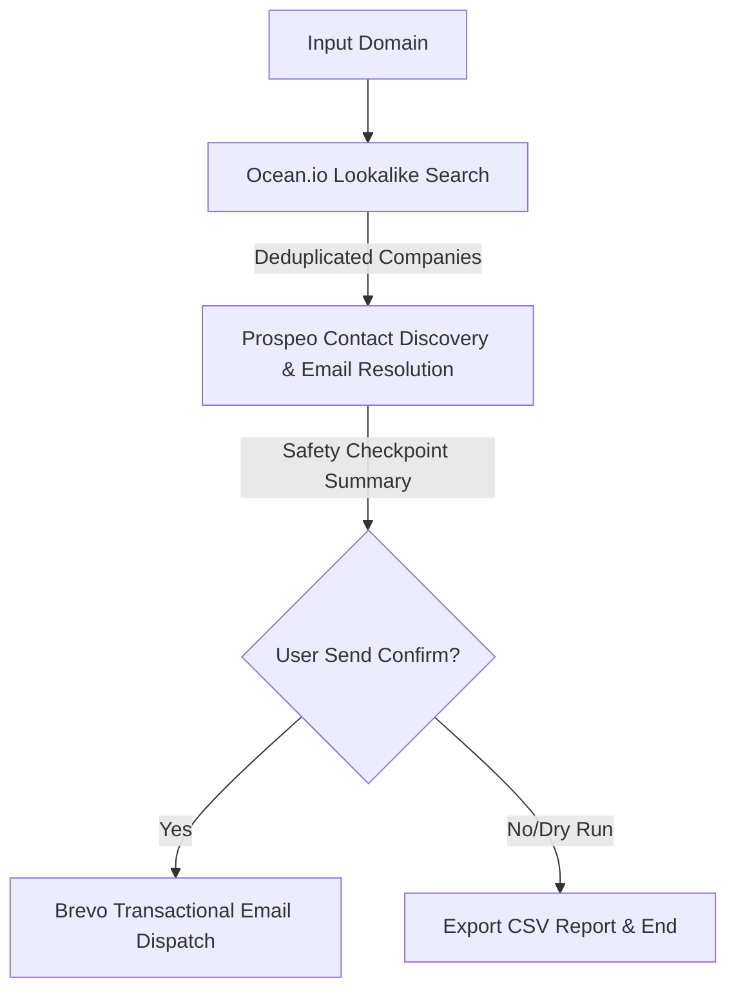

# Automated Outreach Pipeline (CLI)

A production-ready Python CLI cold outreach automation system. Given a single seed company domain, the pipeline automatically discovers lookalikes, extracts key decision-makers, resolves work emails, and queues personalized outreach campaigns.

---

## Architecture & Workflow

The pipeline runs sequentially through three isolated service modules using a single command-line call:



### Sourcing & Verification Sequence
1. **Ocean.io Stage:** Searches similar ICP lookalikes using the seed domain. Returns firmographic profile lists.
2. **Prospeo Stage:** Scans each lookalike company for decision-makers (C-Level, Founders, Directors, VPs) and retrieves their verified corporate email addresses directly using Prospeo's Enrich API.
3. **Safety Checkpoint:** Halts execution, presents sourcing metrics, and asks for confirmation before sending outreach copies.
4. **Brevo Stage:** Personalizes outreach copy templates and dispatches campaigns via Brevo SMTP using batch queues and cooling delays.

---

## Technical Features

* **Pipeline Resume (`--resume`):** Automatically saves progress to `data/checkpoint.json` at every stage boundary. If a network call fails, running with `--resume` restores state from local cache files and picks up exactly where it left off, preventing credit wastage.
* **Dry Run Mode (`--dry-run`):** Executes all discovery and email personalization stages, but skips the actual email delivery step. It outputs the finalized template copies to the console so you can inspect layouts before deploying.
* **Simulation Mode (`--mock`):** Runs the pipeline end-to-end using realistic simulated lookups and validation. Activated only when `--mock` is explicitly passed.
* **De-duplication System:**
  * **Company Level:** Filters duplicate domains from Ocean.io.
  * **Contact Level:** Deduplicates leads sharing identical LinkedIn profile URLs to prevent redundant enrichments and billing.
* **Rate Limit & Batching Queue:** Batches emails (default: 50) and introduces cooling delays between dispatches to maintain SMTP reputation.
* **Sender Email Validation:** Prior to Stage 3 email dispatch, checks for the presence of `SENDER_EMAIL` in the environment. If missing, the pipeline displays `Sender email not configured` and exits gracefully to prevent invalid outreach.
* **Robust Error Retries:** Uses a custom decorator to catch transient network errors and rate limit triggers, retrying requests using exponential backoff with random jitter. Fails fast without retries on non-retryable errors (e.g. 401 Unauthorized or 403 Forbidden).

---

## Credential & Secret Security

> [!IMPORTANT]
> - **Zero Committed Secrets**: All API keys and credentials must be stored strictly in the `.env` file in the project root.
> - **Gitignored Environment**: The `.env` file is explicitly included in `.gitignore` to prevent any sensitive credentials, tokens, or auth keys from being committed to public or private source control repository branches.
> - **No Hardcoding**: Under no circumstances should secrets or API tokens be hardcoded into any Python modules or configuration settings.

---

## Directory Structure

```
outreach-pipeline/
│
├── main.py                     # Entry point and CLI runner
├── config/
│   └── settings.py             # dotenv config, templates, file paths
│
├── services/
│   ├── base_service.py         # Abstract parent class for mock/live handling
│   ├── ocean_service.py        # Ocean.io company lookup integration
│   ├── prospeo_service.py      # Prospeo contact discovery & email resolution
│   └── brevo_service.py        # Brevo SMTP dispatch module
│
├── models/
│   ├── company.py              # Company data class
│   ├── contact.py              # Contact/Lead details class
│   └── email_record.py         # Outbound template and status tracker
│
├── utils/
│   ├── logger.py               # console and logs/pipeline.log logger
│   ├── validators.py           # structural check regex utilities
│   └── helpers.py              # JSON/CSV handling, checkpoint trackers, retry decorators
│
├── data/                       # Sourcing caches and output files (Git ignored)
│   ├── checkpoint.json
│   ├── stage1_companies.json
│   ├── stage2_contacts.json
│   └── outreach_report.csv
│
├── logs/
│   └── pipeline.log            # Production trace logs
│
├── requirements.txt
├── .env.example
└── README.md
```

---

## Installation & Setup

### Prerequisites
* Python 3.12+

### Step 1: Clone and Initialize Environment
Navigate to the `outreach-pipeline` folder:
```bash
python -m venv venv
venv\Scripts\activate
pip install -r requirements.txt
```

### Step 2: Configure Environment Variables
Copy `.env.example` to `.env`:
```bash
copy .env.example .env
```
Fill in your API keys in the `.env` file. Be sure to configure the sender variables:
* `SENDER_EMAIL=your_email@example.com`
* `SENDER_NAME=Your Name`

Do not commit `.env` to source control.

---

## Execution Command-Line Interface

Run the pipeline using these CLI flags:

### 1. Production Run (Uses real APIs)
Execute the pipeline using the configured credentials in `.env`:
```bash
python main.py
```
*Note: If credentials are not set in `.env`, the pipeline will halt with validation errors.*

### 2. Sourcing Dry Run
Execute the full search workflow using live APIs but skip actual email sending:
```bash
python main.py --dry-run
```

### 3. Recovering a Failed Pipeline
If a stage fails or the process is aborted, resume from the last completed stage cache:
```bash
python main.py --resume
```

### 4. Simulation Mode
Run the pipeline end-to-end using realistic simulated lookup and validation handlers without consuming API credits:
```bash
python main.py --mock
```

## Sample Execution Output

Stage 1: Ocean.io
✓ 5 Similar Companies Found

Stage 2: Prospeo
✓ 1 Contact Found
✓ 1 Email Resolved

Safety Checkpoint
Total Companies: 5
Total Contacts: 1
Total Emails: 1

Stage 3: Brevo
✓ Outreach Email Sent Successfully

Pipeline Report Generated:
pipeline_report.json

## Example pipeline_report.json

{
  "companies_found": 5,
  "contacts_found": 1,
  "emails_found": 1,
  "emails_sent": 1,
  "emails_failed": 0,
  "emails_skipped": 0
}

## Key Features

- Ocean.io company discovery integration
- Prospeo contact sourcing and email enrichment
- Brevo email campaign automation
- Command-line based workflow
- Safety checkpoint before outreach dispatch
- Dry-run mode for safe testing
- Mock mode for development and demonstrations
- JSON report generation
- Robust error handling and retry mechanisms
- Contact and company de-duplication
- Environment-based secret management
